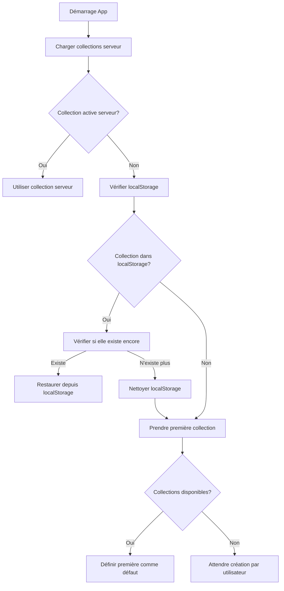

# 🎯 Collection Active & Persistance localStorage

## 📋 **Résumé de l'implémentation**

Cette fonctionnalité permet de :
- **Persister la collection active** dans le localStorage du navigateur
- **Restaurer automatiquement** la collection au démarrage/rafraîchissement 
- **Définir une collection par défaut** si aucune n'est sélectionnée
- **Nettoyer automatiquement** localStorage quand une collection est supprimée

## 🔧 **Modifications apportées**

### 1. **Store Collections Enhanced** (`useCollectionStore.js`)

#### **Nouvelles constantes localStorage :**
```javascript
const STORAGE_KEYS = {
  CURRENT_COLLECTION_ID: 'slufe_current_collection_id',
  DEFAULT_COLLECTION_ID: 'slufe_default_collection_id'
}
```

#### **Nouvelles fonctions utilitaires :**
- `saveCurrentCollectionToStorage(collectionId)` - Sauvegarde dans localStorage
- `getCurrentCollectionFromStorage()` - Récupère depuis localStorage  
- `getDefaultCollectionFromStorage()` - Récupère collection par défaut

#### **Nouveaux computed :**
- `activeCollection` - Collection active avec fallback automatique
- `activeCollectionId` - ID de la collection active

#### **Fonctions modifiées :**
- `setCurrentCollection()` - Sauvegarde maintenant dans localStorage
- `deleteCollection()` - Nettoie localStorage si nécessaire
- `initialize()` - Appelle `initializeCurrentCollection()`

#### **Nouvelle fonction d'initialisation :**
```javascript
initializeCurrentCollection() {
  // 1. Récupère collection active du serveur
  // 2. Si aucune, essaie localStorage 
  // 3. Si aucune, prend la première disponible
  // 4. Si aucune, attend que l'utilisateur en crée une
}
```

### 2. **Layout Principal** (`MainLayout.vue`)

Ajout de l'initialisation automatique au démarrage :
```javascript
onMounted(async () => {
  await collectionStore.initialize()
})
```

### 3. **Router Enhanced** (`routes.js`)

Nouvelle route pour le debug :
```javascript
{ path: 'debug-collections', component: () => import('pages/DebugCollections.vue') }
```

## 🚀 **Logique de fallback pour Collection Active**

### **Ordre de priorité :**
1. **Collection couramment visualisée** (`currentCollection`)
2. **Collection active du serveur** (`serverCurrentCollection`) 
3. **Collection depuis localStorage** (restauration)
4. **Première collection disponible** (par défaut)
5. **Aucune collection** (l'utilisateur doit en créer une)

### **Comportement au démarrage :**


## 📱 **Clés localStorage utilisées**

| Clé | Description | Contenu |
|-----|-------------|---------|
| `slufe_current_collection_id` | Collection actuellement active | ID de la collection (string) |
| `slufe_default_collection_id` | Collection par défaut | ID de la collection (string) |

## 🧪 **Pages de test créées**

### 1. **Test HTML standalone** (`test-collections-localstorage.html`)
- Test indépendant du localStorage
- Simulation de collections
- Vérification de persistance
- Nettoyage et statistiques
- **URL :** `http://localhost:8000/test-collections-localstorage.html`

### 2. **Page Debug Vue** (`/debug-collections`)
- Intégrée dans l'application
- État en temps réel des collections
- Logs de debug
- Actions de test
- **URL :** `http://localhost:9000/#/debug-collections`

## 🔍 **Comment tester**

### **Test basique :**
1. Ouvrir l'application : `http://localhost:9000`
2. Cliquer sur l'icône debug (🐛) dans le header
3. Observer l'état des collections et localStorage
4. Sélectionner une collection
5. Rafraîchir la page (F5)
6. Vérifier que la collection est restaurée

### **Test avancé :**
1. Ouvrir la page de test : `http://localhost:8000/test-collections-localstorage.html`
2. Définir une collection test
3. Rafraîchir pour vérifier la persistance
4. Nettoyer et tester les différents scénarios

### **Test avec localStorage Inspector :**
1. Ouvrir : `http://localhost:8000/localStorage-inspector.html`
2. Observer toutes les clés Slufe
3. Voir les données en temps réel
4. Exporter/modifier les données

## 🛠️ **Utilisation dans les composants**

```javascript
import { useCollectionStore } from 'src/stores/useCollectionStore'

const collectionStore = useCollectionStore()

// Obtenir la collection active (avec fallback automatique)
const activeCollection = computed(() => collectionStore.activeCollection)
const activeCollectionId = computed(() => collectionStore.activeCollectionId)

// Définir une nouvelle collection active (sauvegarde automatique localStorage)
await collectionStore.setCurrentCollection(collectionId)
```

## 🔧 **Maintenance**

### **Nettoyage localStorage en cas de problème :**
```javascript
// Supprimer juste les collections
localStorage.removeItem('slufe_current_collection_id')
localStorage.removeItem('slufe_default_collection_id')

// Ou tout nettoyer
localStorage.clear()
```

### **Debug en console :**
```javascript
// Voir l'état du store
console.log(collectionStore.activeCollection)
console.log(collectionStore.getCurrentCollectionFromStorage())

// Forcer réinitialisation
await collectionStore.initializeCurrentCollection()
```

## ✅ **Avantages de cette approche**

1. **Persistance transparente** - L'utilisateur retrouve sa collection après rafraîchissement
2. **Fallback robuste** - Toujours une collection active si possible
3. **Nettoyage automatique** - Pas d'accumulation de données obsolètes
4. **Debug facile** - Outils intégrés pour diagnostiquer les problèmes
5. **Performance** - Pas de requêtes supplémentaires inutiles
6. **Compatibilité** - Fonctionne même si localStorage est désactivé

## 🚨 **Points d'attention**

- **Synchronisation** : localStorage et serveur peuvent être désynchronisés
- **Suppression** : Nettoyer localStorage quand une collection est supprimée
- **Migration** : Gérer les changements futurs des clés localStorage
- **Privé/Incognito** : localStorage peut être limité dans ces modes

Cette implémentation garantit une expérience utilisateur fluide avec persistance automatique de la collection active ! 🎉